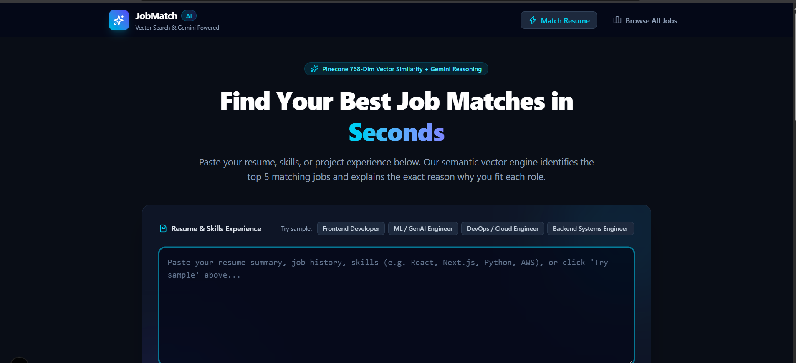

# JobMatch AI

Paste a resume, get the 5 best-matching jobs with a similarity score and a one-sentence explanation of why each one fits.

Built with **Next.js, TypeScript, Node/Express, Pinecone, and the Gemini API**.


<!-- Replace with a screenshot or short screen recording of the match flow -->


## How it works

```
[Resume text]
     │
     ▼  1. Embed
[Gemini embedding model] ──▶ 768-dimension vector
     │
     ▼  2. Vector search
[Pinecone index, cosine similarity] ──▶ top 5 nearest jobs
     │
     ▼  3. Explain
[Gemini Flash] ──▶ one call, strict JSON, one-sentence reason per job
     │
     ▼
[Ranked jobs with similarity % and reasons]
```

1. **Embed.** The resume is converted into a 768-dimension vector with `gemini-embedding-001`. Job descriptions were embedded with the same model and dimension when the index was seeded, so the vectors live in the same space and can be compared.
2. **Vector search.** The resume vector is queried against the Pinecone index using cosine similarity. Pinecone returns the 5 closest job vectors along with their stored metadata.
3. **Explain.** The resume and the 5 matched jobs go to Gemini Flash in a single call. It returns JSON with a short reason for each match.

The similarity score shown in the UI is the cosine similarity from Pinecone expressed as a percentage.

## Tech stack

| Layer | Tools |
|---|---|
| Frontend | Next.js (App Router), TypeScript, Tailwind CSS |
| Backend | Node.js, Express, TypeScript, tsx |
| Vector database | Pinecone (serverless, 768 dimensions, cosine) |
| Embeddings and LLM | Google Gemini API |

## Prerequisites

- Node.js 20 or newer
- A free [Pinecone](https://www.pinecone.io/) account and API key
- A Gemini API key from [Google AI Studio](https://aistudio.google.com/)

## Setup

### 1. Clone and install

```bash
git clone https://github.com/<your-username>/jobmatch-ai.git
cd jobmatch-ai

cd backend && npm install
cd ../frontend && npm install
```

### 2. Create the Pinecone index

In the Pinecone console, create a serverless index with:

- **Name:** `jobmatch`
- **Dimensions:** `768`
- **Metric:** `cosine`
- **Vector type:** Dense

The dimension must match the embedding output exactly, or upserts will fail.

### 3. Configure environment variables

Create `backend/.env`:

```
PINECONE_API_KEY=your_pinecone_api_key
PINECONE_INDEX=jobmatch
GEMINI_API_KEY=your_gemini_api_key
PORT=5000
```

Create `frontend/.env.local`:

```
NEXT_PUBLIC_API_URL=http://localhost:5000
```

`.env` files are git-ignored. Use the `.env.example` files as templates and never commit real keys.

### 4. Seed the index

```bash
cd backend
npm run seed
```

This embeds the 50 jobs in `backend/src/data/jobs.json` and upserts them into Pinecone. It batches requests with small delays and is safe to re-run. When it finishes, the index should show 50 records.

### 5. Run the app

In two terminals:

```bash
# Terminal 1: API on http://localhost:5000
cd backend
npm run dev
```

```bash
# Terminal 2: UI on http://localhost:3000
cd frontend
npm run dev
```

Open http://localhost:3000.

## API

### `POST /match`

Embeds the resume, queries Pinecone, and returns the top 5 jobs with reasons.

Request:

```json
{ "resumeText": "Senior Frontend Engineer with 6+ years of React, Next.js, TypeScript..." }
```

Response:

```json
[
  {
    "id": "job-1",
    "title": "Senior Frontend Engineer",
    "company": "Voxel Cloud",
    "location": "San Francisco, CA (Hybrid)",
    "score": 76,
    "reason": "..."
  }
]
```

### `GET /jobs`

Returns the job catalog from `jobs.json`. Supports `?q=<term>` to filter.

### `GET /health`

Returns `{"status":"ok","service":"jobmatch-backend"}`.

## Features

- Resume input with character counter and sample resumes (frontend, ML, DevOps, backend)
- Ranked job cards with a similarity bar and a Gemini-written reason
- Loading and error states
- Browse page (`/jobs`) with text search and category filters

## Project structure

```
backend/
  src/
    config/env.ts       environment loader
    data/jobs.json      50 sample jobs
    routes/             /match and /jobs handlers
    scripts/seed.ts     embeds jobs and upserts to Pinecone
    services/           Gemini and Pinecone clients
    index.ts            Express entry point
frontend/
  src/app/              pages (matcher and browse)
  src/components/       shared UI
```

## Limitations

- The 50 jobs are synthetic sample data, not live listings.
- Scores are embedding similarity, not a measure of candidate quality. Similar jobs often score close together.
- The "reason" text is LLM-generated and can occasionally overstate a fit.
- There is no authentication or rate limiting, and the free tiers of Gemini and Pinecone have usage caps.

## Possible next steps

- Ingest real job feeds and refresh embeddings on a schedule
- Hybrid search (keyword plus vector) and metadata filters such as location
- Resume file upload (PDF parsing)
- Deployment with rate limiting